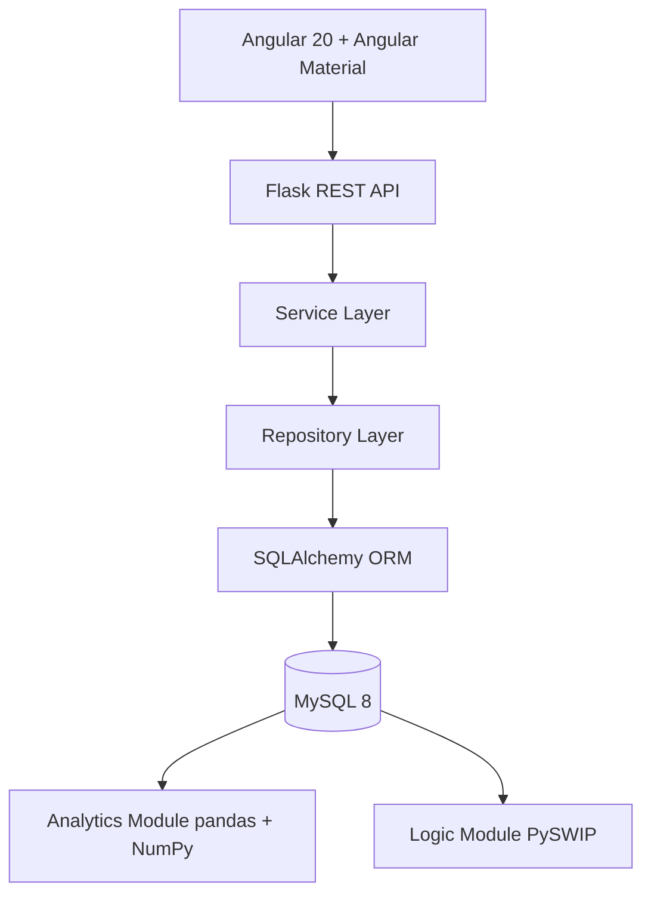

# Arquitectura UTP+EVALUA

## Capas

- `controllers`: recursos RESTX, validacion de acceso y entrada HTTP.
- `services`: reglas de negocio, composicion y funciones puras de calculo.
- `repositories`: acceso a datos, paginacion, busqueda, filtros y ordenamiento.
- `models`: entidades SQLAlchemy y relaciones.
- `analytics`: reportes con pandas, NumPy, Matplotlib y OpenPyXL.
- `logic`: hechos y reglas Prolog consumidos desde PySWIP.
