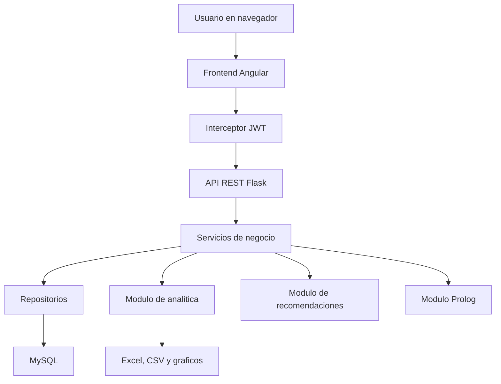
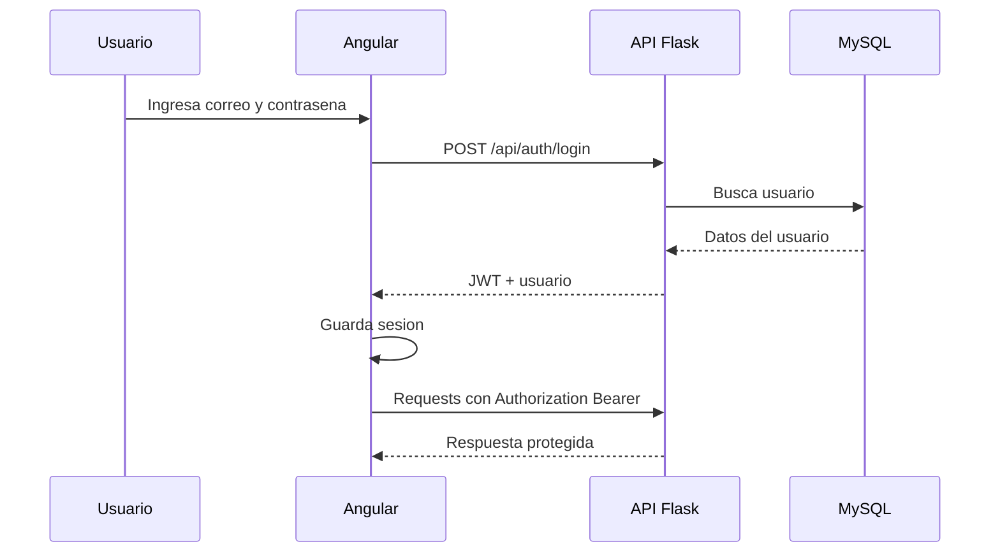
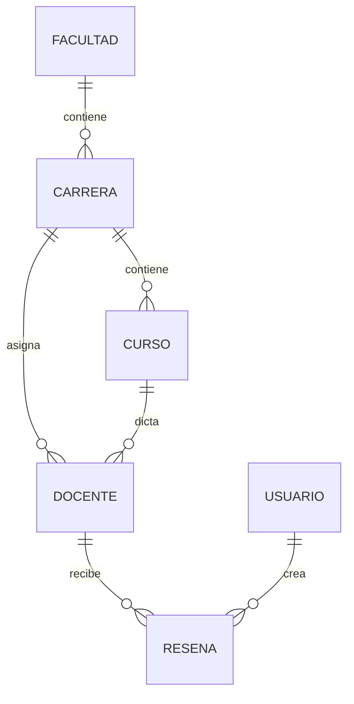
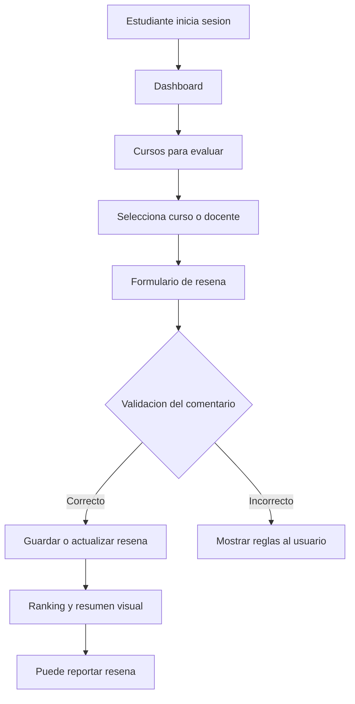
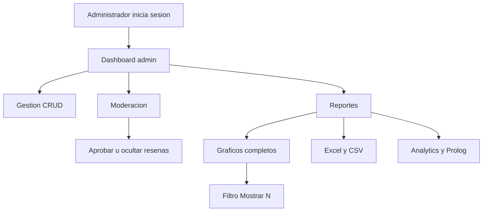
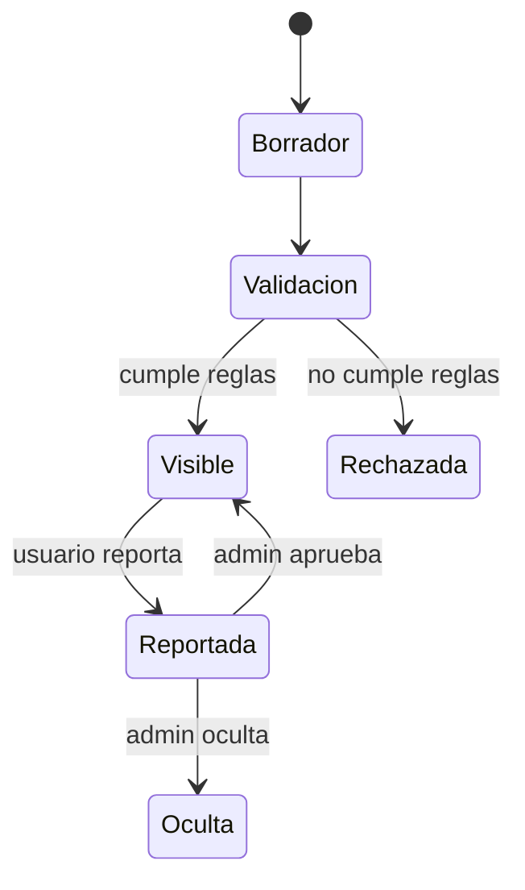

# Flujo del proyecto UTP+EVALUA

Documento base para preparar una presentacion del proyecto. Resume que problema resuelve, como esta construido, como fluye la informacion y que funcionalidades principales existen por rol.

## 1. Resumen ejecutivo

UTP+EVALUA es una plataforma web universitaria para evaluar docentes de forma responsable, trazable y anonima desde la vista del estudiante, y con herramientas de gestion, moderacion y analitica desde la vista del administrador.

El sistema permite:

- Registrar usuarios con rol de estudiante o administrador.
- Consultar docentes, carreras y cursos.
- Crear resenas de docentes asociadas a carrera y curso.
- Evitar abuso mediante reglas de validacion, limite de duplicados y moderacion.
- Mostrar rankings y graficos de desempeno.
- Exportar reportes administrativos en Excel y CSV.
- Aplicar analitica con NumPy, pandas y Matplotlib.
- Aplicar reglas de logica con Prolog/PySWIP para inferencias academicas.

## 2. Problema que resuelve

En un entorno universitario, los estudiantes necesitan una forma ordenada de compartir experiencias sobre docentes, pero sin que el sistema se convierta en spam, insultos o datos poco confiables.

UTP+EVALUA busca resolver tres puntos:

- Falta de retroalimentacion centralizada sobre docentes.
- Riesgo de resenas duplicadas, ofensivas o manipuladas.
- Necesidad de reportes claros para tomar decisiones academicas.

## 3. Usuarios del sistema

### Estudiante

El estudiante puede iniciar sesion, navegar por docentes, cursos, carreras, crear una resena, consultar rankings resumidos y reportar una resena si considera que es ofensiva o falsa.

### Administrador

El administrador puede gestionar entidades principales, revisar datos completos, moderar resenas reportadas, consultar analitica avanzada, exportar informacion y visualizar graficos completos del sistema.

## 4. Arquitectura general

El proyecto esta dividido en tres capas principales:

- Frontend: Angular 20 con Angular Material.
- Backend: Flask RESTX en Python.
- Base de datos: MySQL 8.

Ademas, el backend contiene modulos especializados:

- CRUD y servicios de negocio.
- Recomendaciones.
- Analitica con NumPy, pandas y Matplotlib.
- Logica e inferencia con Prolog/PySWIP.
- Seguridad con JWT y roles.



## 5. Estructura principal de carpetas

```text
UTP-EVALUA/
  frontend/
    src/app/
      core/
        guards/
        interceptors/
        services/
        models.ts
      features/
        auth/
        dashboard/
        courses/
        teachers/
        reviews/
        reports/
        moderation/
        faculties/
        careers/
        students/
      layout/
      shared/
  backend/
    app/
      controllers/
      services/
      repositories/
      models/
      schemas/
      analytics/
      logic/
      utils/
      routes/
      middleware/
      database/
    tests/
  database/
    schema.sql
    seed.sql
    cursos_sistemas.sql
    docentes_sistemas.sql
    docentes_cursos_aleatorios.sql
  docker/
  docs/
  docker-compose.yml
```

## 6. Flujo de autenticacion y seguridad

El acceso al sistema se controla con JWT.

1. El usuario ingresa correo y contrasena en el login.
2. Angular envia las credenciales a `/api/auth/login`.
3. Flask valida usuario, contrasena y estado de cuenta.
4. Si las credenciales son correctas, la API devuelve un token JWT y los datos del usuario.
5. Angular guarda la sesion y usa el interceptor para enviar `Authorization: Bearer <token>`.
6. Las rutas internas usan `authGuard`.
7. Las rutas administrativas usan `adminGuard`.
8. Si el token vence o es invalido, el interceptor limpia la sesion y redirige al login.



## 7. Rutas principales del frontend

| Ruta | Acceso | Proposito |
| --- | --- | --- |
| `/login` | Publico | Inicio de sesion y registro estudiantil |
| `/dashboard` | Usuario autenticado | Vista inicial con resumen y accesos rapidos |
| `/facultades` | Administrador | Gestion de facultades |
| `/carreras` | Usuario autenticado | Consulta y gestion segun permisos |
| `/cursos` | Usuario autenticado | Cursos para evaluar |
| `/docentes` | Usuario autenticado | Docentes y cursos asignados |
| `/estudiantes` | Administrador | Gestion de estudiantes |
| `/moderacion` | Administrador | Revision de resenas reportadas |
| `/resenas` | Usuario autenticado | Crear, consultar y reportar resenas |
| `/reportes` | Usuario autenticado | Rankings y graficos segun rol |

## 8. API REST principal

Los namespaces registrados en la API son:

| Namespace | Proposito |
| --- | --- |
| `/api/auth` | Login, registro y sesion |
| `/api/dashboard` | Indicadores generales |
| `/api/facultades` | CRUD de facultades |
| `/api/carreras` | CRUD de carreras |
| `/api/cursos` | CRUD de cursos |
| `/api/docentes` | CRUD y consulta de docentes |
| `/api/estudiantes` | Gestion de estudiantes |
| `/api/resenas` | Resenas, reportes y moderacion |
| `/api/recomendaciones` | Recomendaciones |
| `/api/reportes` | Analitica, graficos, exportaciones y Prolog |

## 9. Modelo funcional de datos

Entidades principales:

- Usuario: representa estudiantes y administradores.
- Facultad: agrupa carreras.
- Carrera: agrupa cursos y docentes.
- Curso: asignado a una carrera.
- Docente: pertenece a facultad, carrera y puede estar ligado a un curso.
- Resena: evaluacion hecha por un estudiante a un docente.

Relaciones importantes:

- Una facultad tiene muchas carreras.
- Una carrera tiene muchos cursos.
- Una carrera tiene muchos docentes.
- Un docente puede tener un curso asignado.
- Un docente tiene muchas resenas.
- Un estudiante puede crear resenas, pero se controla el abuso.



## 10. Flujo del estudiante

1. Inicia sesion con sus credenciales.
2. Accede al dashboard con resumen general.
3. Consulta cursos para evaluar.
4. Selecciona un docente o curso.
5. El sistema filtra docentes y cursos relacionados para evitar seleccion incorrecta.
6. Crea una resena con calificacion y comentario.
7. La validacion revisa longitud, contenido, URLs, abuso de mayusculas, texto repetido o contenido vacio disfrazado.
8. Si ya evaluo a ese docente, el flujo permite actualizar su resena en vez de duplicar impacto.
9. Puede consultar rankings resumidos con graficos no tecnicos.
10. Puede reportar una resena ofensiva o falsa.



## 11. Flujo del administrador

1. Inicia sesion como administrador.
2. Accede al dashboard administrativo.
3. Gestiona facultades, carreras, cursos, docentes y estudiantes.
4. Revisa resenas reportadas en la pestaña de moderacion.
5. Decide aprobar u ocultar resenas.
6. Consulta rankings completos.
7. Filtra los graficos por cantidad de registros, por ejemplo top N docentes.
8. Revisa analitica completa.
9. Exporta reportes en Excel o CSV.
10. Consulta inferencias Prolog para detectar patrones academicos.



## 12. Flujo de creacion y control de resenas

La resena pasa por varias reglas antes de impactar en los rankings.

Reglas aplicadas o contempladas en el flujo:

- Una resena por estudiante y docente.
- Actualizar resena en vez de crear duplicados.
- Validacion de comentario.
- Reporte de resena ofensiva o falsa.
- Moderacion manual por administrador.
- Estados de resena: visible, reportada u oculta.



## 13. Rankings y graficos

La vista de reportes cambia segun el rol.

### Administrador

El administrador ve graficos completos y tecnicos:

- Ranking completo de docentes.
- Promedio por carrera.
- Promedio por facultad.
- Evolucion mensual de resenas.
- Distribucion de calificaciones.
- Estado de resenas.
- Cobertura de evaluaciones.

Tambien puede filtrar los graficos principales con un selector `Mostrar N`, por ejemplo 5, 10, 20, 50 o 100 registros.

### Estudiante

El estudiante ve una version resumida y orientada a decision:

- Docentes mejor evaluados.
- Promedio por carrera.
- Distribucion general.

No ve paneles tecnicos, exportaciones ni herramientas administrativas.

## 14. Analitica con Python

El modulo `backend/app/analytics/reports.py` cumple la parte tecnica de analitica.

Incluye:

- NumPy para calculos numericos.
- pandas para DataFrames.
- Matplotlib para graficos exportables.
- Exportacion a Excel.
- Exportacion a CSV.

Indicadores generados:

- Promedio de calificaciones.
- Desviacion estandar.
- Varianza.
- Normalizacion de notas.
- Percentiles.
- Promedio por facultad.
- Promedio por carrera.
- Ranking de docentes.
- Cantidad de resenas.
- Evolucion mensual de resenas.

## 15. Logica con Prolog/PySWIP

El modulo `backend/app/logic/` contiene reglas logicas para inferir informacion academica desde los datos.

Ejemplos de preguntas que puede responder:

- Que docentes tienen promedio mayor a 4.5.
- Que carrera tiene mejor promedio.
- Que facultades necesitan seguimiento.
- Que docentes tienen muchas resenas.
- Que docentes pertenecen a Ingenieria.

Si SWI-Prolog no esta disponible, el sistema devuelve una advertencia sin romper el resto de la aplicacion.

## 16. Docker y ejecucion

El proyecto se levanta con Docker Compose.

Servicios:

| Servicio | Contenedor | Puerto |
| --- | --- | --- |
| Frontend | `utp_evalua_frontend` | `4200` |
| Backend | `utp_evalua_backend` | `5000` |
| MySQL | `utp_evalua_mysql` | `3308:3306` |

Comando principal:

```bash
docker compose up -d --build
```

URLs:

- Frontend: `http://localhost:4200`
- API: `http://localhost:5000/api`
- Swagger JSON: `http://localhost:5000/api/swagger.json`
- MySQL desde host: `localhost:3308`

## 17. Credenciales demo

| Rol | Correo | Contrasena |
| --- | --- | --- |
| Administrador | `admin@utp.edu.pe` | `Admin123*` |
| Estudiante | `estudiante@utp.edu.pe` | `Estudiante123*` |

## 18. Validaciones importantes

### Seguridad de rutas

- Sin sesion no se puede entrar a rutas internas.
- Las rutas de administrador estan protegidas con `adminGuard`.
- El backend tambien valida roles con decoradores de seguridad.
- Si el token es invalido o expira, la sesion se limpia automaticamente.

### Validacion de resenas

- Evita comentarios vacios.
- Controla minimo y maximo de caracteres.
- Bloquea URLs.
- Detecta contenido ofensivo comun.
- Controla mayusculas excesivas.
- Detecta texto repetido o poco informativo.

### Control contra manipulacion

- Una resena por estudiante y docente.
- Si el estudiante ya evaluo, se actualiza la resena.
- Los reportes no eliminan automaticamente; pasan a revision.

## 19. Valor academico del proyecto

El proyecto evidencia conocimientos de:

- Angular y componentes standalone.
- Consumo de API REST.
- Flask RESTX.
- SQLAlchemy y relaciones.
- MySQL.
- JWT y roles.
- CRUD completo.
- Validaciones de negocio.
- Analitica con Python.
- NumPy, pandas y Matplotlib.
- Exportacion Excel/CSV.
- Programacion logica con Prolog.
- Docker y despliegue local por contenedores.
- Pruebas automatizadas en backend.

## 20. Propuesta de estructura para presentacion

1. Titulo: UTP+EVALUA.
2. Problema identificado.
3. Objetivo general.
4. Usuarios del sistema.
5. Arquitectura general.
6. Flujo de autenticacion.
7. Flujo del estudiante.
8. Flujo del administrador.
9. Gestion de resenas y moderacion.
10. Modelo de datos.
11. Rankings y graficos.
12. Analitica con Python.
13. Logica con Prolog.
14. Docker y ejecucion.
15. Validaciones y seguridad.
16. Demo del sistema.
17. Conclusiones.

## 21. Guion breve para exponer

UTP+EVALUA es una plataforma de evaluacion docente orientada a mejorar la retroalimentacion academica. El estudiante puede evaluar docentes de forma controlada, consultando cursos, carreras y rankings resumidos. El administrador cuenta con herramientas de gestion, moderacion, reportes completos y analitica avanzada.

La arquitectura separa frontend, backend y base de datos. Angular consume una API REST construida en Flask, mientras que MySQL almacena usuarios, docentes, cursos, carreras y resenas. El backend aplica reglas de seguridad con JWT, validaciones contra mal uso y modulos de analitica con NumPy, pandas y Matplotlib. Tambien incorpora Prolog para responder preguntas logicas sobre los datos.

El valor principal del proyecto es que no solo permite registrar resenas, sino que controla su calidad, evita manipulacion, permite moderacion y transforma los datos en indicadores utiles para la toma de decisiones.
